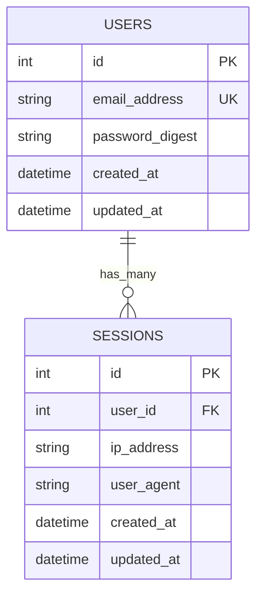
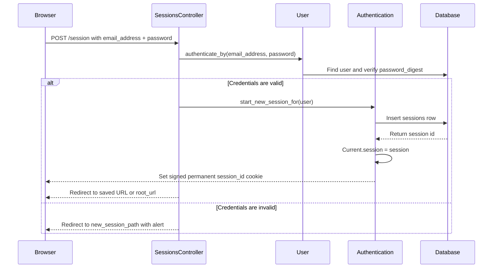
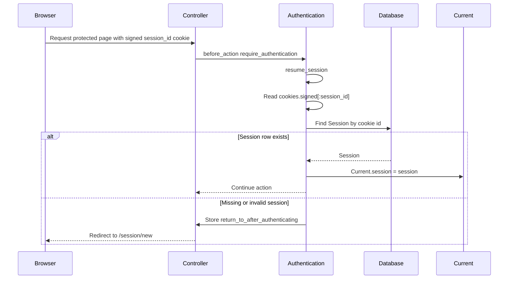
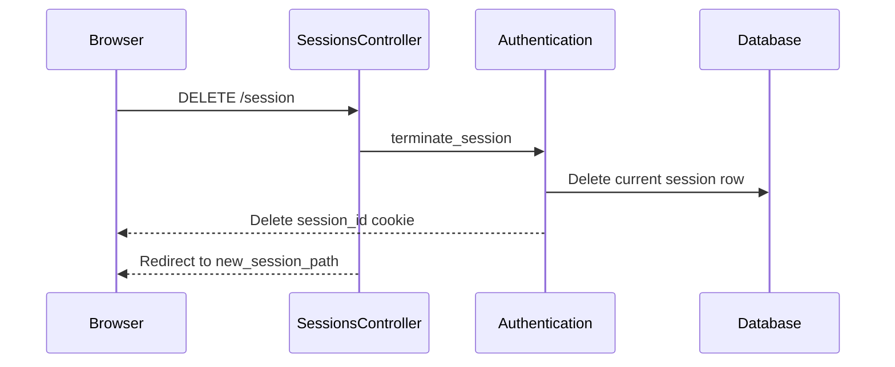
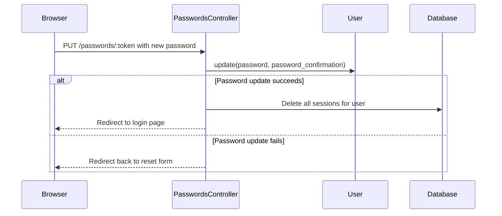
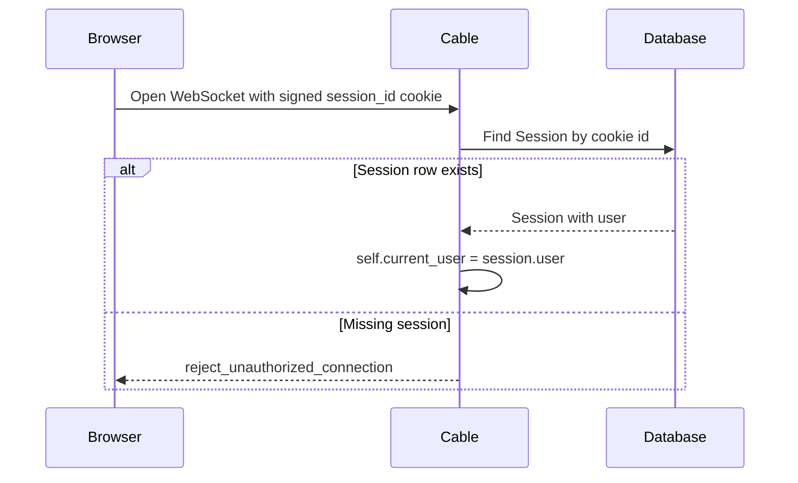

# Authentication Flow

This Rails app uses database-backed login sessions.

The browser does not store the whole session record. It stores only a signed
`session_id` cookie. The server uses that cookie value to find a row in the
`sessions` table, then gets the authenticated user through `Session#user`.

## Main Files

| Area | File | Purpose |
| --- | --- | --- |
| Routes | `config/routes.rb` | Defines `resource :session` for login/logout and `resources :passwords` for password reset. |
| Global controller auth | `app/controllers/application_controller.rb` | Includes the `Authentication` concern in every controller. |
| Auth concern | `app/controllers/concerns/authentication.rb` | Checks the signed cookie, loads the DB session, redirects unauthenticated users, creates sessions, and destroys sessions. |
| Login controller | `app/controllers/sessions_controller.rb` | Handles sign-in form, credential check, session creation, and logout. |
| Login form | `app/views/sessions/new.html.erb` | Posts `email_address` and `password` to `session_path`. |
| User model | `app/models/user.rb` | Uses `has_secure_password` and owns many sessions. |
| Session model | `app/models/session.rb` | Each session belongs to a user. |
| Current request state | `app/models/current.rb` | Stores `Current.session` and exposes `Current.user`. |
| DB schema | `db/schema.rb` | Defines `users` and `sessions` tables. |
| Sessions migration | `db/migrate/20260618095516_create_sessions.rb` | Creates DB-backed session records with `user_id`, `ip_address`, and `user_agent`. |
| Password reset | `app/controllers/passwords_controller.rb` | Sends reset mail and destroys all user sessions after password change. |
| Action Cable auth | `app/channels/application_cable/connection.rb` | Authenticates WebSocket connections from the same signed `session_id` cookie. |
| Tests | `test/controllers/sessions_controller_test.rb` | Covers login success, login failure, and logout cookie behavior. |

## Data Model



Important details:

- `users.password_digest` stores the hashed password created by `has_secure_password`.
- `sessions.user_id` links a login session to one user.
- `sessions.ip_address` and `sessions.user_agent` are saved when login succeeds.
- `sessions` has a foreign key to `users`.
- Deleting a user also deletes that user's sessions because `User` has `has_many :sessions, dependent: :destroy`.

## Login Flow



The login entry point is `SessionsController#create`.

```ruby
if user = User.authenticate_by(params.permit(:email_address, :password))
  start_new_session_for user
  redirect_to after_authentication_url
else
  redirect_to new_session_path, alert: "Try another email address or password."
end
```

`User.authenticate_by` comes from Rails' secure password/authentication support.
It checks the submitted password against `users.password_digest`.

When credentials are valid, `start_new_session_for(user)` does three things:

1. Creates a database row through `user.sessions.create!`.
2. Stores that row in `Current.session` for the current request.
3. Writes a signed permanent cookie named `session_id`.

```ruby
cookies.signed.permanent[:session_id] = {
  value: session.id,
  httponly: true,
  same_site: :lax
}
```

That cookie is signed by Rails, so the browser can hold the ID but cannot safely
tamper with it.

## Authenticated Request Flow



`ApplicationController` includes `Authentication`, so every controller gets this
default protection:

```ruby
before_action :require_authentication
helper_method :authenticated?
```

The important methods are:

- `require_authentication`: lets the request continue only if `resume_session`
  finds a DB session.
- `resume_session`: memoizes the loaded session in `Current.session`.
- `find_session_by_cookie`: reads `cookies.signed[:session_id]` and finds the
  matching `Session` row.
- `request_authentication`: stores the URL the user tried to visit and redirects
  to the login page.
- `after_authentication_url`: redirects back to the saved URL after login, or to
  `root_url`.

## Public vs Protected Pages

By default, actions are protected because `ApplicationController` includes the
auth concern.

Controllers can opt out with `allow_unauthenticated_access`.

Current public areas:

- `SessionsController#new` and `SessionsController#create`
- all `PasswordsController` actions
- `ProductsController#index` and `ProductsController#show`

Current protected product actions:

- `ProductsController#new`
- `ProductsController#create`
- `ProductsController#edit`
- `ProductsController#update`
- `ProductsController#destroy`

The layout also uses `authenticated?` to decide whether to show `Log out` or
`Login`.

## Logout Flow



Logout is handled by `SessionsController#destroy`.

`terminate_session` destroys `Current.session` in the database and deletes the
browser cookie:

```ruby
Current.session.destroy
cookies.delete(:session_id)
```

After that, the old cookie no longer maps to a valid `sessions` row.

## Password Reset Session Invalidation



After a successful password reset, `PasswordsController#update` runs:

```ruby
@user.sessions.destroy_all
```

This logs the user out everywhere by deleting every database session row for
that user. Existing browsers may still have old cookies, but those cookies no
longer authenticate because their `session_id` values no longer exist in the
database.

## Action Cable Authentication



`ApplicationCable::Connection#set_current_user` uses the same signed cookie and
same `sessions` table as normal HTTP requests.

## Summary

The authentication state lives in two places:

1. Browser: signed `session_id` cookie only.
2. Database: full `sessions` row linked to a `users` row.

On each protected request, Rails verifies the signed cookie, loads the matching
`Session` from the database, puts it in `Current.session`, and allows the
controller action to continue. If the cookie is missing, invalid, or points to a
deleted session row, the user is redirected to the login page.
